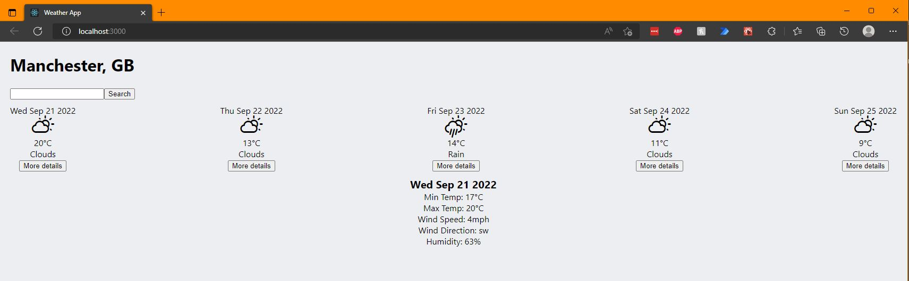
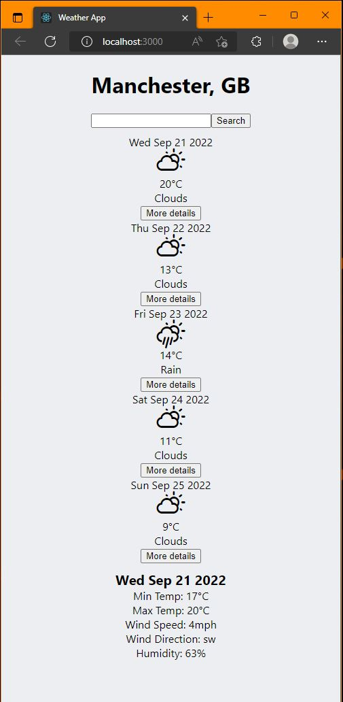

# Weather App

## About

A weather application built using React. Enter a valid city and you will be returned with the weather forecast for the next 5 days, you can click on each day's forecast for more detail. The weather data is fetched from the Mancester Codes Weather API.

This project was bootstrapped with [Create React App](https://github.com/facebook/create-react-app).

## Installation

- Clone this repo and `cd` into it in your IDE
- Run `npm install`
- Run `npm start`

## Available Scripts

In the project directory, you can run:

### `npm start`

Runs the app in the development mode.\
Open [http://localhost:3000](http://localhost:3000) to view it in your browser.

The page will reload when you make changes.\
You may also see any lint errors in the console.

### `npm test`

Launches the test runner in the interactive watch mode.\
See the section about [running tests](https://facebook.github.io/create-react-app/docs/running-tests) for more information.

## Technologies Used

### Language

- React

### Testing Utilities

- Jest
- React Testing Library

### Packages

- Axios
- PropTypes

## Screenshots

### Desktop

### Mobile

### Author

- Will Hodgkinson
